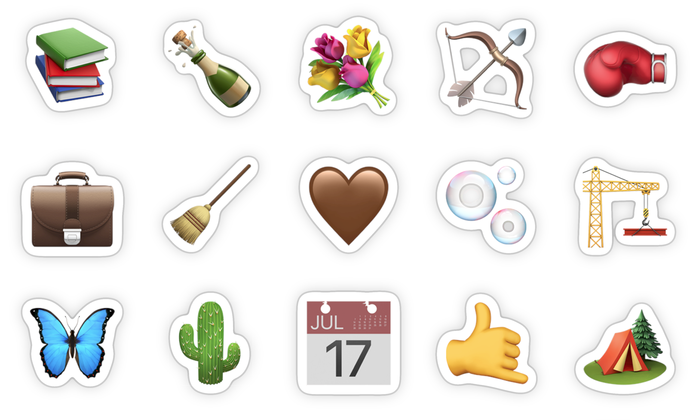

# Sticker SVG filter

A SVG filter for making things look like stickers. It adds a white rounded background to the filtered element, and a shadow with an outline.

The filter uses multiple blurs, so performance isn't great when applied to many elements or a large region.  
Also, translucent regions are holey images can look strange. This hasn't been tested on a real website at all!

The filter has a few parameters called out for easy tweaking—search the source for “tweakable”.

Based on a design by [Stefan](https://heystefan.com/).

